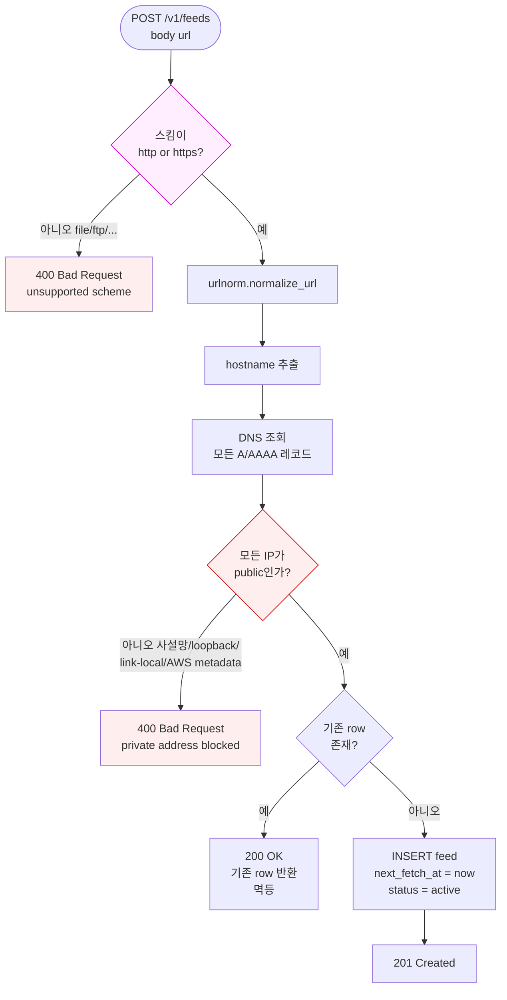
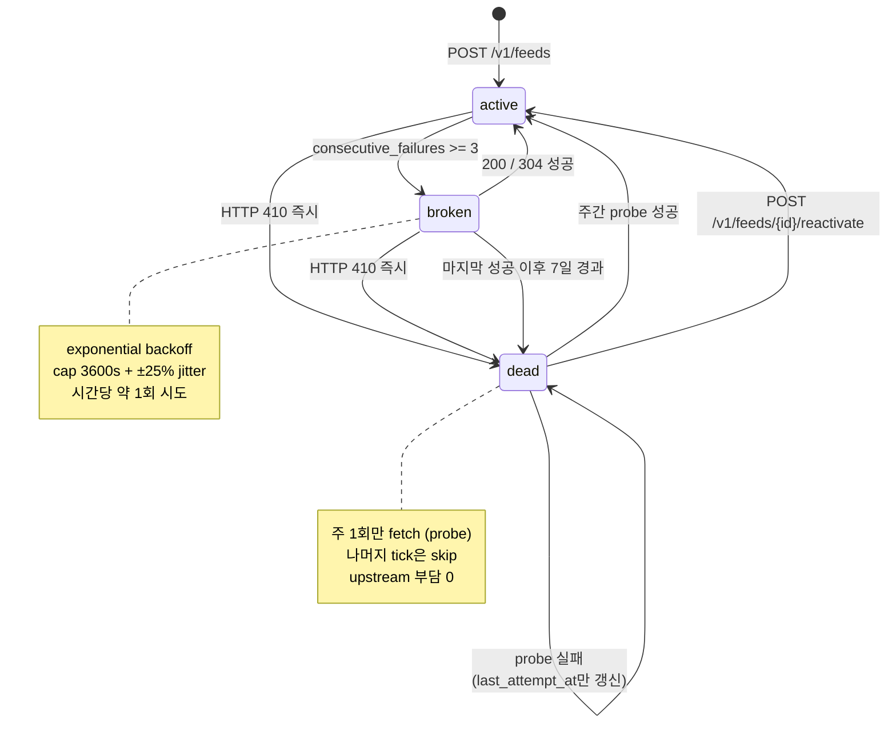
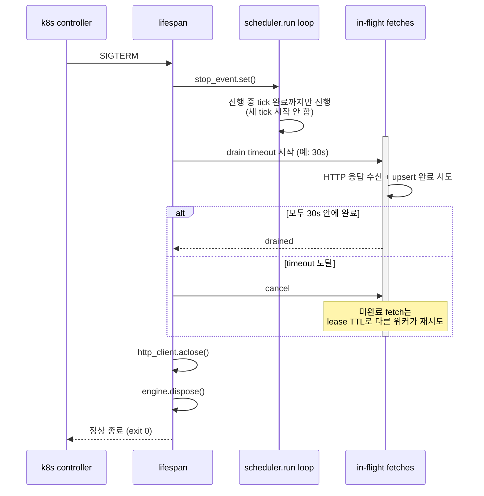
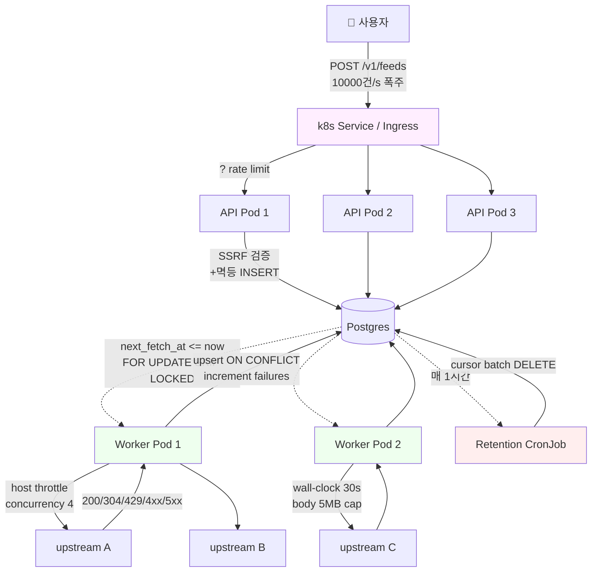

# Spec: Resilience & Load Mitigation

- 상태: Draft v1
- 마지막 업데이트: 2026-04-12
- 관련 ADR: 000, 001, 002, 003
- 관련 spec: [`feed.md`](feed.md), [`entry.md`](entry.md)
- 관련 tests: [`../tests/resilience-test-cases.md`](../tests/resilience-test-cases.md) — 모든 위협 ID에 대한 TC 매핑 카탈로그

이 문서는 feedgate-fetcher가 **악의적/병적 입력, upstream 장애, 인프라 사고**에
직면했을 때 어떤 방어선을 어떤 순서로 작동시키는지 — 그리고 그 결과가
머메이드 다이어그램으로 어떻게 닫힌 흐름을 이루는지 — 를 정의한다.

핵심 원칙: **링크 부식과 외부 장애는 정상 입력**(ADR 000). 우리는 모든
실패 케이스가 자동 복구 가능하거나, 적어도 다른 피드의 처리를 막지 않도록
설계해야 한다.

## 1. 위협 모델 (Threat Catalog)

위협은 4개 카테고리로 묶는다.

| ID | 위협 | 영향 | 발생 가능성 |
|---|---|---|---|
| **A. 단일 피드 → 우리 워커 폭격** |
| A1 | 5GB 이상 응답 본문 (메모리 폭발) | OOM kill | 중 |
| A2 | 압축 폭탄 (5MB → 5GB 해제) | OOM kill | 낮음 |
| A3 | Slow Loris (1바이트/19초) | 워커 stall | 낮음 |
| A4 | 첫 fetch에 1만 entries | DB write storm | 중 |
| A5 | 무한 redirect chain | 워커 stall | 낮음 |
| A6 | 무효 TLS 인증서 | 일시 실패 | 높음 |
| A7 | 매 fetch마다 새 guid 100개 | DB INSERT 폭주 | 중 |
| A8 | 영구 4xx (Cloudflare WAF 차단) | 무한 재시도 | 높음 |
| **B. 다수 피드 → 동시 장애** |
| B1 | CDN 장애로 50개 피드 동시 timeout | 워커 saturate | 중 |
| B2 | broken 피드 100개 동시 backoff cap 해제 (thundering herd) | upstream 폭격 | 중 |
| B3 | 같은 호스트에 100개 피드 등록 → 100 동시 GET | upstream IP 차단 | 높음 |
| B4 | upstream 429 폭탄 | 의미 없는 재시도 | 높음 |
| **C. 우리 인프라 한계** |
| C1 | Postgres 커넥션 풀 고갈 | 신규 fetch 실패 | 중 |
| C2 | retention sweep이 1시간 초과 | 디스크 폭발 | 낮음 (장기) |
| C3 | tick_once 예외 propagate | 스케줄러 죽음 | 낮음 |
| C4 | 워커 OOM kill (in-flight fetch 손실) | 일부 fetch 누락 | 중 |
| C5 | rolling deploy SIGTERM (in-flight fetch 강제 종료) | 매 deploy마다 손실 | 높음 |
| C6 | DB 일시 단절 (네트워크 partition) | 에러 로그 폭주 | 낮음 |
| **D. 악의적 / SSRF** |
| D1 | `POST /v1/feeds {url:"http://169.254.169.254/..."}` (AWS metadata) | 메타데이터 leak | **높음 (보안)** |
| D2 | `http://127.0.0.1:5432/...` (DB 포트 정찰) | 정찰 leak | 중 |
| D3 | `file:///etc/passwd` | 로컬 파일 leak | 낮음 (httpx 미지원) |
| D4 | redirect가 내부 IP로 점프 | SSRF 우회 | 중 |
| D5 | 1초당 1000회 `POST /v1/feeds` (등록 폭주) | API saturate | 중 |
| D6 | 같은 URL 멱등 등록 N회 | 무영향 (idempotent) | 낮음 |

## 2. 방어 레이어 모델 (3-Tier)

모든 위협은 3단계 방어선 중 하나 이상으로 흡수된다.

```mermaid
flowchart LR
    subgraph T1["Tier 1 — Prevent (입구 차단)"]
        P1[URL 정규화]
        P2[SSRF 호스트 검증]
        P3[Content-Type 화이트리스트 거부]
        P4[Per-host throttle]
        P5[API rate limit]
    end
    subgraph T2["Tier 2 — Contain (피해 격리)"]
        C1[fetch_concurrency 세마포어]
        C2[Body size cap 5MB]
        C3[fetch_timeout 20s + wall-clock 30s]
        C4[max_entries_initial 50]
        C5[per-feed 세션 격리]
        C6[SKIP LOCKED claim 격리]
    end
    subgraph T3["Tier 3 — Recover (자동 복구)"]
        R1[State machine: active→broken→dead]
        R2[Exponential backoff + jitter]
        R3[429 Retry-After 존중]
        R4[Lease TTL 자동 재배정]
        R5[ON CONFLICT no-op]
        R6[Weekly dead probe]
        R7[Manual reactivate API]
    end
    T1 --> T2 --> T3
```



| 위협 | Tier 1 (Prevent) | Tier 2 (Contain) | Tier 3 (Recover) | 상태 |
|---|---|---|---|---|
| A1 거대 응답 | — | Body cap 5MB streaming | — | ✅ |
| A2 압축 폭탄 | — | Body cap on **decompressed bytes** | — | ✅ |
| A3 Slow Loris | — | wall-clock 30s + read 10s | — | ❌ wall-clock 미구현 |
| A4 첫 fetch 1만 entries | — | max_entries_initial=50 | — | ✅ |
| A5 redirect loop | — | redirect cap (httpx 기본 20) | — | ⚠️ 명시적 설정 없음 |
| A6 TLS 무효 | — | TLS verify=True | broken → dead | ✅ |
| A7 매번 새 guid 100개 | — | (cap 없음) | ON CONFLICT 무관 | ⚠️ 누적 부담 |
| A8 영구 4xx | — | — | broken → dead 후 주 1회 | ✅ |
| B1 동시 timeout | — | fetch_concurrency=4 | 다음 tick 정상 | ⚠️ stall 시간 |
| B2 thundering herd | — | — | ±25% jitter | ✅ |
| B3 동일 호스트 폭격 | per-host throttle | — | 429 처리 | ❌ 미구현 |
| B4 429 폭탄 | per-host throttle | — | Retry-After 존중 | ✅ Retry-After만 |
| C1 Postgres pool 고갈 | — | pool_size 튜닝 | — | ⚠️ 기본값 |
| C2 retention 지연 | — | cursor batch | — | ⚠️ 미구현 |
| C3 tick 예외 | — | run() try/except | — | ✅ |
| C4 워커 OOM | — | — | Lease TTL 재배정 | ✅ |
| C5 rolling deploy | — | graceful drain | Lease TTL 재배정 | ❌ drain 미구현 |
| C6 DB 단절 | — | — | next tick 재시도 | ⚠️ 로그 폭주 |
| D1 AWS metadata SSRF | **호스트 IP 검증** | — | — | ❌ 미구현 |
| D2 DB 포트 정찰 | **호스트 IP 검증** | not_a_feed | — | ❌ 미구현 |
| D3 file:// | scheme 화이트리스트 | — | — | ✅ |
| D4 redirect SSRF | follow_redirects 수동 검증 | — | — | ❌ 미구현 |
| D5 API 폭주 | API rate limit | — | — | ❌ 미구현 |
| D6 멱등 POST | — | — | upsert idempotent | ✅ |

**범례**: ✅ 구현됨 / ⚠️ 부분 / ❌ 미구현

## 3. 시나리오별 방어 로직 (Mermaid)

### 3.1 피드 등록 — `POST /v1/feeds`



**방어 포인트:**
- `A` 스킴 검증 → D3 `file://` 차단
- `E` SSRF IP 검증 → D1, D2 차단 (구현 예정)
- `F` 멱등 → D6 폭주 무력화

### 3.2 단일 fetch — `fetch_one` 전체 흐름

이 다이어그램은 한 피드의 1회 fetch에서 적용되는 모든 방어선을 한 번에 표시한다.

```mermaid
flowchart TD
    Start([fetch_one 진입]) --> A[last_attempt_at = now]
    A --> AA{호스트 throttle<br/>슬롯 가능?}
    AA -->|RPS 초과| AB[await throttle.acquire<br/>최대 N초]
    AB --> B
    AA -->|OK| B[조건부 헤더 부착]
    B --> BA{feed.etag 있음?}
    BA -->|예| BB[If-None-Match 추가]
    BA -->|아니오| BC{feed.last_modified<br/>있음?}
    BB --> BC
    BC -->|예| BD[If-Modified-Since 추가]
    BC -->|아니오| C
    BD --> C[asyncio.timeout 30s 래퍼<br/>+ httpx connect 5s / read 10s]
    C --> D[HTTP GET stream]
    D --> E{follow_redirects}
    E -->|301/302/307/308| EA{redirect 호스트가<br/>여전히 public인가?}
    EA -->|아니오| EB[redirect_blocked<br/>fail++]
    EA -->|예| D
    E -->|aborted: connect| F1[connection]
    E -->|aborted: read timeout| F2[timeout]
    E -->|aborted: tls| F3[tls_error]
    E -->|response received| G{status_code}

    G -->|304| H1[Not Modified<br/>본문 안 받음<br/>SUCCESS path]
    G -->|410| H2[http_410<br/>즉시 dead 전이]
    G -->|429| H3[Retry-After 파싱<br/>RFC 7231 sec or HTTP-date]
    H3 --> H3A[rate_limited<br/>fail 카운터 증가 안 함<br/>next_fetch_at = now+max retry,base]
    G -->|4xx other| F4[http_4xx]
    G -->|5xx| F5[http_5xx]
    G -->|200| I{Content-Type<br/>화이트리스트}
    I -->|html/json/text| F6[not_a_feed]
    I -->|xml/atom/rss/...| J[stream body]

    J --> K{누적 size > 5MB?}
    K -->|예| F7[too_large<br/>스트림 abort]
    K -->|아니오| L{wall-clock 30s<br/>초과?}
    L -->|예| F2
    L -->|아니오| M{본문 끝?}
    M -->|아니오| J
    M -->|예| N[parse_feed]

    N -->|예외| F8[parse_error]
    N -->|성공| O{첫 fetch이고<br/>entries > 50?}
    O -->|예| O1[entries[:50] truncate]
    O -->|아니오| O2
    O1 --> O2[upsert_entries 루프]
    O2 --> P[etag/last_modified 저장<br/>title 갱신<br/>last_successful_fetch_at = now<br/>fail = 0<br/>code = null]
    P --> Q{현재 status<br/>!= active?}
    Q -->|예| Q1[active 전이<br/>+ WARNING 로그]
    Q -->|아니오| R
    Q1 --> R[next_fetch_at 재계산<br/>active: now+60s<br/>broken: backoff+jitter]
    H1 --> P

    F1 & F2 & F3 & F4 & F5 & F6 & F7 & F8 & EB --> S[fail += 1<br/>last_error_code 기록]
    S --> T{fail >= 3?}
    T -->|예 + active| T1[broken 전이]
    T -->|아니오| U
    T1 --> U{broken 상태이고<br/>last_success 7일 경과?}
    U -->|예| U1[dead 전이]
    U -->|아니오| R
    U1 --> R
    H2 --> R

    R --> End([fetch_one 종료])
    H3A --> End

    style AA fill:#fef,stroke:#c0c
    style EA fill:#fee,stroke:#c00
    style I fill:#ffe,stroke:#cc0
    style K fill:#ffe,stroke:#cc0
    style L fill:#ffe,stroke:#cc0
    style C fill:#ffe,stroke:#cc0
```

**방어 포인트 (위협 ID 매핑):**

| 노드 | 방어 위협 | 비고 |
|---|---|---|
| `AA` per-host throttle | B3, B4 | ❌ 미구현 |
| `BA/BC` 조건부 헤더 | A7 (간접) | ⚠️ DB 컬럼만 있음 |
| `C` wall-clock + 세분 timeout | A3, A5, B1 | ⚠️ wall-clock 미구현 |
| `EA` redirect SSRF 재검증 | D4 | ❌ 미구현 |
| `I` Content-Type 화이트리스트 | A1 (HTML 폭격), D2 | ✅ |
| `K` body cap 5MB | A1, A2 | ✅ |
| `O` initial entries cap | A4 | ✅ |
| `H3` Retry-After (sec + HTTP-date) | B4 | ✅ (PR #7) |
| `T/U` lifecycle 전이 | A8 | ✅ |
| `H2` 즉시 dead | A8 (410) | ✅ |

### 3.3 스케줄러 tick — claim & dispatch

```mermaid
sequenceDiagram
    autonumber
    participant W1 as Worker A
    participant W2 as Worker B
    participant DB as Postgres feeds

    rect rgb(245, 235, 255)
    Note over W1,W2: 두 워커가 동시에 tick 시작
    W1->>DB: BEGIN; SELECT FOR UPDATE SKIP LOCKED LIMIT 8
    activate W1
    W2->>DB: BEGIN; SELECT FOR UPDATE SKIP LOCKED LIMIT 8
    activate W2
    DB-->>W1: feeds [1..8] (W1 lock)
    DB-->>W2: feeds [9..16] (W1 행 skip)
    W1->>DB: UPDATE next_fetch_at=now+180s, last_attempt_at=now
    W2->>DB: UPDATE next_fetch_at=now+180s, last_attempt_at=now
    W1->>DB: COMMIT (lock 해제, lease persist)
    deactivate W1
    W2->>DB: COMMIT (lock 해제, lease persist)
    deactivate W2
    end

    Note over W1,W2: claim 끝, fetch는 새 세션에서

    par 워커 A 병렬 fetch
        W1->>W1: fetch feeds 1..8 (HTTP, semaphore=4)
        W1->>DB: 각 feed 결과 update (real next_fetch_at)
    and 워커 B 병렬 fetch
        W2->>W2: fetch feeds 9..16
        W2->>DB: 각 feed 결과 update
    end

    Note over W1,W2: 만약 W1이 fetch 중 OOM kill되면?

    rect rgb(255, 235, 235)
    W1-->>W1: 💥 OOM kill 도중 종료
    Note over DB: feeds 1..8의<br/>next_fetch_at = now+180s 그대로
    Note over W1,W2: 180초 동안은 어떤 워커도 못 집음
    end

    Note over W2: 180초 후, 다음 tick
    W2->>DB: SELECT FOR UPDATE SKIP LOCKED ...
    DB-->>W2: feeds [1..8] (lease 만료, 다시 보임)
    W2->>W2: fetch + recover
```

**방어 포인트:**
- SKIP LOCKED → C4 (워커 OOM 후 재배정), B1 (한 워커 stall 시 다른 워커 진행)
- Lease TTL bump → 두 워커가 같은 행을 동시에 처리하는 것 방지

### 3.4 피드 생애 상태 머신



**방어 포인트:**
- 영구 죽은 도메인(A8) → 1주일 안에 dead로 격리, 이후 무시
- recovery 자동성: probe 성공 시 자동 active 복귀

### 3.5 per-host throttle 결정 (PR #N 예정)

```mermaid
flowchart LR
    A[fetch_one 진입] --> B[urlparse hostname]
    B --> C{host_limiter[host]<br/>슬롯 acquire 가능?}
    C -->|예| D[즉시 진행]
    C -->|아니오| E[await acquire<br/>최대 wait_seconds]
    E --> C
    D --> F[HTTP GET]
    F --> G[release slot]

    note1[medium.com 100개 피드 등록 →<br/>RPS 1 제한 → 100초에 걸쳐 분산]
    style C fill:#fef,stroke:#c0c
```

**방어 포인트**: B3 (호스트 폭격), B4 (429 폭탄을 미연 방지). 미구현.

### 3.6 Graceful shutdown drain



**방어 포인트:**
- C5 rolling deploy 시 in-flight fetch 손실 최소화
- k8s `terminationGracePeriodSeconds`와 맞춤 (예: drain 30s → grace 60s)
- 미완료된 건은 어차피 lease TTL 경과 후 다른 워커가 자동 재시도 (이중 방어)

## 4. End-to-End 부하 흐름 (사용자 → DB)



각 화살표에서 어떤 방어선이 작동하는지:

| 화살표 | 방어선 |
|---|---|
| User → LB | API rate limit (❌ 미구현) |
| LB → API | k8s LB 자체 |
| API → PG (등록) | SSRF 검증 (❌), 멱등 (✅), URL 정규화 (✅) |
| PG → Worker (claim) | SKIP LOCKED + lease (✅) |
| Worker → upstream | host throttle (❌), timeout (⚠️), body cap (✅) |
| upstream → Worker | content-type (✅), Retry-After (✅) |
| Worker → PG (upsert) | ON CONFLICT no-op (✅), 풀 튜닝 (⚠️) |
| CronJob → PG | cursor batch (❌) |

## 5. 부하 완화 카탈로그 (구현 우선순위)

운영 진입을 위해 **반드시 해결**해야 할 항목들. 위협 매핑과 PR 사이즈 기준 우선순위.

| 우선순위 | 항목 | 위협 ID | 방어 Tier | PR 사이즈 |
|---|---|---|---|---|
| **P0 보안** | SSRF 호스트 IP 검증 | D1, D2, D4 | T1 Prevent | S |
| **P1 운영** | per-host throttle | B3, B4 | T1 Prevent | M |
| **P1 운영** | wall-clock 전체 timeout + 세분 httpx Timeout | A3, A5, B1 | T2 Contain | XS |
| **P1 운영** | graceful shutdown drain | C5 | T2 Contain | S |
| **P1 운영** | Postgres 풀 튜닝 + pool_pre_ping | C1, C6 | T2 Contain | XS |
| **P2 비용** | ETag / If-Modified-Since 조건부 GET | A7, B1 (간접) | T2 Contain | XS |
| **P2 비용** | executemany batch upsert | A7 | T2 Contain | S |
| **P2 운영** | retention cursor batch | C2 | T2 Contain | M |
| **P2 운영** | API rate limit (slowapi/limits) | D5 | T1 Prevent | S |
| **P3 가시성** | Prometheus /metrics | (전체) | — | M |
| **P3 가시성** | 구조화 로깅 (structlog/json) | (전체) | — | S |
| **P3 운영** | DB 단절 백오프 (로그 폭주 방지) | C6 | T3 Recover | XS |
| **P4 운영** | AIMD 동적 fetch_concurrency | B1 | T3 Recover | M |

**최소 운영 가능 = P0 + P1** (예상 작업 1.5일).

## 6. 메트릭 (Tier 3 Recover의 가시성)

위 방어선이 실제로 작동하는지 확인하려면 다음 지표가 필요하다 (Prometheus 노출 예정):

```
fetch_outcome_total{code="success"|"timeout"|"http_4xx"|"http_5xx"|"rate_limited"|"not_a_feed"|"too_large"|"connection"|"tls_error"|"parse_error"|"redirect_blocked"}
fetch_duration_seconds_bucket{le="..."}
fetch_body_bytes_bucket{le="..."}
host_throttle_wait_seconds_bucket{host="..."}

feed_state_count{state="active"|"broken"|"dead"}
feed_consecutive_failures_bucket{le="..."}

claim_batch_size
claim_lease_recoveries_total      # lease TTL로 재배정된 횟수

entries_inserted_total
entries_updated_total              # WHERE IS DISTINCT FROM 통과
entries_unchanged_total            # ON CONFLICT no-op

ssrf_blocked_total{phase="register"|"redirect"}
api_rate_limited_total{path="..."}
db_pool_in_use, db_pool_size
```

**alerting 예시**:
- `rate(fetch_outcome_total{code="timeout"}[5m]) > 0.3 * rate(fetch_outcome_total[5m])` → upstream 광역 장애
- `feed_state_count{state="dead"}` 급증 → 시스템 상 결함 의심
- `db_pool_in_use / db_pool_size > 0.9` → 풀 곧 고갈

## 7. 전제 (Assumptions)

이 문서의 방어 모델이 성립하는 전제:

1. **Postgres가 단일 신뢰점**. 워커 N대는 Postgres를 통해서만 좌표한다.
   Postgres가 죽으면 전체가 멈춘다 (의도된 trade-off).
2. **DNS는 신뢰 가능**. SSRF 검증은 DNS 응답을 신뢰한다 (DNS rebinding은
   별도 fetch-time 재검증으로 mitigate).
3. **시계 동기**. 워커 간 시계 차이는 lease TTL(180s)보다 충분히 작다.
4. **upstream은 대체로 정직**. 악의적 upstream(예: 무한 stream, 거대 압축)은
   Tier 2 cap으로 흡수한다.
5. **k8s가 SIGTERM 후 충분한 grace period**를 준다. `terminationGracePeriodSeconds`는
   drain 시간(30s)보다 커야 한다.

## 8. 미해결

- Tier 3 일부 방어가 메트릭 없이는 검증 불가능 → P3 가시성이 사실상 필수.
- AIMD fetch_concurrency 동적 조정 — 운영 데이터 보고 결정.
- DB 외 다른 SPOF (예: container registry, secret store) 처리는 인프라 책임으로 위임.
